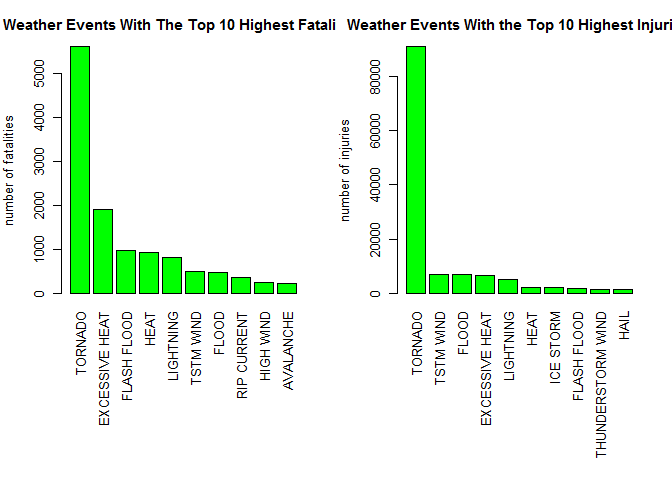
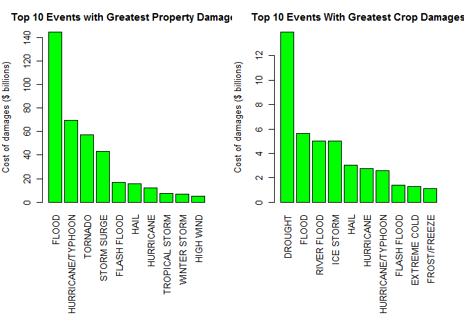

## Reproducible Research: Peer Assessment 2

## U.S. National Oceanic and Atmospheric Administration's (NOAA) storm database analysis

## SYNOPSIS

This report consists in analyzing the NOAA storm database containing data on extreme climate events. This data was collected during the period from 1950 through 2011. The purpose of this analysis is to answer the following two questions:

- Across the United States, which types of events (as indicated in the EVTYPE variable) are most harmful with respect to population health?

- Across the United States, which types of events have the greatest economic consequences?


## Data Processing


```r
setwd( "C:/Users/soujanya/Desktop/Coursera")
install.packages("R.utils",repos="http://cran.rstudio.com/")
```

```
## Installing package into 'C:/Users/soujanya/Documents/R/win-library/3.1'
## (as 'lib' is unspecified)
```

```
## 
##   There is a binary version available (and will be installed) but
##   the source version is later:
##         binary source
## R.utils  2.0.0  2.0.1
## 
## package 'R.utils' successfully unpacked and MD5 sums checked
## 
## The downloaded binary packages are in
## 	C:\Users\soujanya\AppData\Local\Temp\Rtmp82rPdl\downloaded_packages
```

```r
library(R.utils)
```

```
## Warning: package 'R.utils' was built under R version 3.1.3
```

```
## Loading required package: R.oo
```

```
## Warning: package 'R.oo' was built under R version 3.1.3
```

```
## Loading required package: R.methodsS3
```

```
## Warning: package 'R.methodsS3' was built under R version 3.1.3
```

```
## R.methodsS3 v1.7.0 (2015-02-19) successfully loaded. See ?R.methodsS3 for help.
## R.oo v1.19.0 (2015-02-27) successfully loaded. See ?R.oo for help.
## 
## Attaching package: 'R.oo'
## 
## The following objects are masked from 'package:methods':
## 
##     getClasses, getMethods
## 
## The following objects are masked from 'package:base':
## 
##     attach, detach, gc, load, save
## 
## R.utils v2.0.0 (2015-02-28) successfully loaded. See ?R.utils for help.
## 
## Attaching package: 'R.utils'
## 
## The following object is masked from 'package:utils':
## 
##     timestamp
## 
## The following objects are masked from 'package:base':
## 
##     cat, commandArgs, getOption, inherits, isOpen, parse, warnings
```

```r
# load data into R
storm <- read.csv("repdata-data-StormData.csv")
head(storm)
```

```
##   STATE__           BGN_DATE BGN_TIME TIME_ZONE COUNTY COUNTYNAME STATE
## 1       1  4/18/1950 0:00:00     0130       CST     97     MOBILE    AL
## 2       1  4/18/1950 0:00:00     0145       CST      3    BALDWIN    AL
## 3       1  2/20/1951 0:00:00     1600       CST     57    FAYETTE    AL
## 4       1   6/8/1951 0:00:00     0900       CST     89    MADISON    AL
## 5       1 11/15/1951 0:00:00     1500       CST     43    CULLMAN    AL
## 6       1 11/15/1951 0:00:00     2000       CST     77 LAUDERDALE    AL
##    EVTYPE BGN_RANGE BGN_AZI BGN_LOCATI END_DATE END_TIME COUNTY_END
## 1 TORNADO         0                                               0
## 2 TORNADO         0                                               0
## 3 TORNADO         0                                               0
## 4 TORNADO         0                                               0
## 5 TORNADO         0                                               0
## 6 TORNADO         0                                               0
##   COUNTYENDN END_RANGE END_AZI END_LOCATI LENGTH WIDTH F MAG FATALITIES
## 1         NA         0                      14.0   100 3   0          0
## 2         NA         0                       2.0   150 2   0          0
## 3         NA         0                       0.1   123 2   0          0
## 4         NA         0                       0.0   100 2   0          0
## 5         NA         0                       0.0   150 2   0          0
## 6         NA         0                       1.5   177 2   0          0
##   INJURIES PROPDMG PROPDMGEXP CROPDMG CROPDMGEXP WFO STATEOFFIC ZONENAMES
## 1       15    25.0          K       0                                    
## 2        0     2.5          K       0                                    
## 3        2    25.0          K       0                                    
## 4        2     2.5          K       0                                    
## 5        2     2.5          K       0                                    
## 6        6     2.5          K       0                                    
##   LATITUDE LONGITUDE LATITUDE_E LONGITUDE_ REMARKS REFNUM
## 1     3040      8812       3051       8806              1
## 2     3042      8755          0          0              2
## 3     3340      8742          0          0              3
## 4     3458      8626          0          0              4
## 5     3412      8642          0          0              5
## 6     3450      8748          0          0              6
```

### subset the data to health and economic impact analysis against weather event

```r
Event <- c("EVTYPE", "FATALITIES", "INJURIES", "PROPDMG", "PROPDMGEXP", "CROPDMG", 
    "CROPDMGEXP")
required_data <- storm[Event]
```

### Preparing the property damage data

#### exploring the property exponent

```r
unique(required_data$PROPDMGEXP)
```

```
##  [1] K M   B m + 0 5 6 ? 4 2 3 h 7 H - 1 8
## Levels:  - ? + 0 1 2 3 4 5 6 7 8 B h H K m M
```

### Sorting the property exponent data

```r
required_data$PROPEXP[required_data$PROPDMGEXP == "K"] <- 1000
required_data$PROPEXP[required_data$PROPDMGEXP == "M"] <- 1e+06
required_data$PROPEXP[required_data$PROPDMGEXP == ""] <- 1
required_data$PROPEXP[required_data$PROPDMGEXP == "B"] <- 1e+09
required_data$PROPEXP[required_data$PROPDMGEXP == "m"] <- 1e+06
required_data$PROPEXP[required_data$PROPDMGEXP == "0"] <- 1
required_data$PROPEXP[required_data$PROPDMGEXP == "5"] <- 1e+05
required_data$PROPEXP[required_data$PROPDMGEXP == "6"] <- 1e+06
required_data$PROPEXP[required_data$PROPDMGEXP == "4"] <- 10000
required_data$PROPEXP[required_data$PROPDMGEXP == "2"] <- 100
required_data$PROPEXP[required_data$PROPDMGEXP == "3"] <- 1000
required_data$PROPEXP[required_data$PROPDMGEXP == "h"] <- 100
required_data$PROPEXP[required_data$PROPDMGEXP == "7"] <- 1e+07
required_data$PROPEXP[required_data$PROPDMGEXP == "H"] <- 100
required_data$PROPEXP[required_data$PROPDMGEXP == "1"] <- 10
required_data$PROPEXP[required_data$PROPDMGEXP == "8"] <- 1e+08
#### give 0 to invalid exponent data, so they not count in
required_data$PROPEXP[required_data$PROPDMGEXP == "+"] <- 0
required_data$PROPEXP[required_data$PROPDMGEXP == "-"] <- 0
required_data$PROPEXP[required_data$PROPDMGEXP == "?"] <- 0
#### compute the property damage value
required_data$PROPDMGVAL <- required_data$PROPDMG * required_data$PROPEXP
```

### Preparing the crop damage data

#### exploring the crop exponent data

```r
unique(required_data$CROPDMGEXP)
```

```
## [1]   M K m B ? 0 k 2
## Levels:  ? 0 2 B k K m M
```

### Sorting the property exponent data

```r
required_data$CROPEXP[required_data$CROPDMGEXP == "M"] <- 1e+06
required_data$CROPEXP[required_data$CROPDMGEXP == "K"] <- 1000
required_data$CROPEXP[required_data$CROPDMGEXP == "m"] <- 1e+06
required_data$CROPEXP[required_data$CROPDMGEXP == "B"] <- 1e+09
required_data$CROPEXP[required_data$CROPDMGEXP == "0"] <- 1
required_data$CROPEXP[required_data$CROPDMGEXP == "k"] <- 1000
required_data$CROPEXP[required_data$CROPDMGEXP == "2"] <- 100
required_data$CROPEXP[required_data$CROPDMGEXP == ""] <- 1
#### give 0 to invalid exponent data, so they not count in
required_data$CROPEXP[required_data$CROPDMGEXP == "?"] <- 0
#### compute the crop damage value
required_data$CROPDMGVAL <- required_data$CROPDMG * required_data$CROPEXP
```

### Aggregate the data by event

#### aggregate the data by event

```r
fatal <- aggregate(FATALITIES ~ EVTYPE, data = required_data, FUN = sum)
injury <- aggregate(INJURIES ~ EVTYPE, data = required_data, FUN = sum)
propdmg <- aggregate(PROPDMGVAL ~ EVTYPE, data = required_data, FUN = sum)
cropdmg <- aggregate(CROPDMGVAL ~ EVTYPE, data = required_data, FUN = sum)
```

## Results 
### Aross the United States, Which types of events are nost harmful with respect to population health?

#### get top10 event with highest fatalities

```r
fatal10 <- fatal[order(-fatal$FATALITIES), ][1:10, ]
#### get top10 event with highest injuries
injury10 <- injury[order(-injury$INJURIES), ][1:10, ]
par(mfrow = c(1, 2), mar = c(12, 4, 3, 2), mgp = c(3, 1, 0), cex = 0.8)
barplot(fatal10$FATALITIES, las = 3, names.arg = fatal10$EVTYPE, main = "Weather Events With The Top 10 Highest Fatalities", 
    ylab = "number of fatalities", col = "green")
barplot(injury10$INJURIES, las = 3, names.arg = injury10$EVTYPE, main = "Weather Events With the Top 10 Highest Injuries", 
    ylab = "number of injuries", col = "green")
```

 

#### The most harmful weather event to population health is Tornado.It is cause for both the highest fatalities and the highest injuries across United States.

### Across the United States, which types of events have the greatest economic consequences?

#### get top 10 events with highest property damage

```r
propdmg10 <- propdmg[order(-propdmg$PROPDMGVAL), ][1:10, ]
#### get top 10 events with highest crop damage
cropdmg10 <- cropdmg[order(-cropdmg$CROPDMGVAL), ][1:10, ]
par(mfrow = c(1, 2), mar = c(12, 4, 3, 2), mgp = c(3, 1, 0), cex = 0.8)
barplot(propdmg10$PROPDMGVAL/(10^9), las = 3, names.arg = propdmg10$EVTYPE, 
    main = "Top 10 Events with Greatest Property Damages", ylab = "Cost of damages ($ billions)", 
    col = "green")
barplot(cropdmg10$CROPDMGVAL/(10^9), las = 3, names.arg = cropdmg10$EVTYPE, 
    main = "Top 10 Events With Greatest Crop Damages", ylab = "Cost of damages ($ billions)", 
    col = "green")
```

 

#### The weather events have the greatest economic consequences are: flood, drought, Tornado and Typhoon.

#### Across the United States, flood, tornado and typhoon have caused the greatest damage to properties. Drought and flood come as the causes for the greatest damage to crops.
